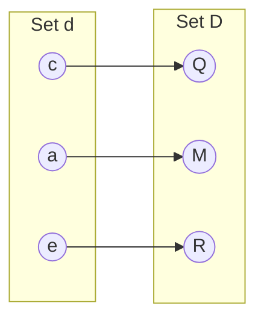
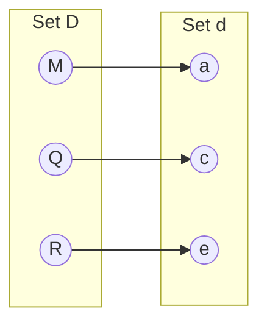
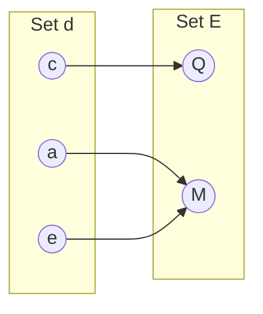
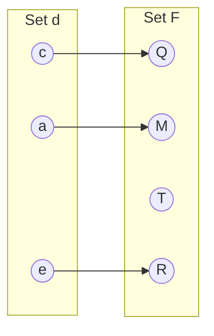

## 集合與映射 Sets and Mappings

映射（mapping），也稱為函數（function），是數學與程式設計中的基本概念。

就像程式中的函式一樣，數學中的映射會接收某種類型的輸入，並將它對應（回傳）成某種類型的物件。

常見的重要集合包括：

- $\mathbb{R}$：實數（real numbers）
- $\mathbb{R}_{\ge 0}$：非負實數（包含 0）
- $\mathbb{R}^2$：二維平面上的有序對
- $\mathbb{R}^n$：$n$ 維笛卡兒空間中的點
- $\mathbb{Z}$：整數
- $S^2$：三維空間 $\mathbb{R}^3$ 中位於單位球面上的點集合

## Inverse Mappings

如果存在一個函數

$$
f : A \to B
$$

就可能存在一個反函數

$$
f^{-1} : B \to A
$$

其定義規則為：

$$
f^{-1}(b)=a
$$

其中

$$
b=f(a)
$$

但這個定義只有在以下條件成立時才有效：

1. 每個 $b \in B$ 都必須是某個 $a$ 經由 $f$ 映射後得到的結果（也就是說，函數的值域等於目標集合）。

2. 對每個 $b$，只能有唯一的一個 $a$ 使得

   $$
   f(a)=b
   $$

這種映射（或函數）稱為 **bijection**。

**bijection** 的意思是：

- 每個 $a \in A$ 都對應到唯一的一個 $b \in B$
- 而且對每個 $b \in B$，都恰好存在唯一的一個 $a \in A$ 使得 $f(a)=b$

$$
f : d \to D
$$

$$
f^{-1} : D \to d
$$

---

例如，在「騎士與馬匹」之間建立 **bijection**，表示：

- 每個人都騎著一匹馬
- 每匹馬也都被某個人騎著

此時可以定義兩個函數：

- `rider(horse)`：由馬找到騎士
- `horse(rider)`：由騎士找到馬

這兩個函數互為反函數。

不是雙射（bijection）的函數就沒有反函數（見圖 2.2）。

$$
g : d \to E
$$

$$
h : d \to F
$$

---

一個 **bijection** 的例子是：

$$
f:\mathbb{R}\to\mathbb{R},
\quad
f(x)=x^3
$$

它的反函數為：

$$
f^{-1}(x)=\sqrt[3]{x}
$$

這個例子顯示，標準記號有時會讓人感到不太直觀，因為在 $f$ 與 $f^{-1}$ 中都用了 $x$ 作為 dummy variable。

因此有時改寫成

$$
y=f(x)
$$

以及

$$
x=f^{-1}(y)
$$

會比較容易理解。

如此便得到

$$
y=x^3
$$

以及

$$
x=\sqrt[3]{y}
$$

---

一個沒有反函數的例子是：

$$
\mathrm{sqr}:\mathbb{R}\to\mathbb{R},
\quad
\mathrm{sqr}(x)=x^2
$$

它沒有反函數有兩個原因：

1. 因為

   $$
   x^2=(-x)^2
   $$

   也就是兩個不同的輸入可能得到同樣的輸出，因此不具唯一性。

2. 沒有任何實數平方後會得到負數，所以目標集合中的負數部分沒有對應來源。

---

不過，如果我們把定義域與值域限制在正實數集合

$$
\mathbb{R}_{\ge 0}
$$

那麼

$$
\sqrt{x}
$$

就可以成為合法的反函數。

## 區間 Intervals

我們經常需要指定一個函數所處理的實數，其取值受到某些限制。

其中一種限制方式就是指定一個 **區間（interval）**。

例如，介於 $0$ 與 $1$ 之間、但**不包含** $0$ 與 $1$ 的所有實數，可表示為：

$$
(0,1)
$$

因為它不包含端點，所以稱為 **開區間（open interval）**。

相對地，包含端點的 **閉區間（closed interval）** 則用中括號表示：

$$
[0,1]
$$

這種表示法也可以混合使用，例如：

$$
[0,1)
$$

表示包含 $0$，但不包含 $1$。

當我們寫一個區間 $[a,b]$ 時，預設 $a \le b$。

---

區間的 Cartesian product 也很常使用。

例如，要表示一個點 $x$ 位於三維空間中的單位立方體（unit cube）內，可以寫成：

$$
x \in [0,1]^3
$$

---

### 交集（Intersection）

交集表示兩個區間共同擁有的點，使用符號：

$$
\cap
$$

例如：

$$
[3,5)\cap[4,6]=[4,5)
$$

---

### 聯集（Union）

聯集表示屬於任一區間的點，使用符號：

$$
\cup
$$

例如：

$$
[3,5)\cup[4,6]=[3,6]
$$

---

### 差集（Difference）

差集表示左側區間中，不屬於右側區間的點。

例如：

$$
[3,5)-[4,6]=[3,4)
$$

而

$$
[4,6]-[3,5)=[5,6]
$$

---

這些運算通常可以透過 **interval diagrams** 來視覺化理解。
